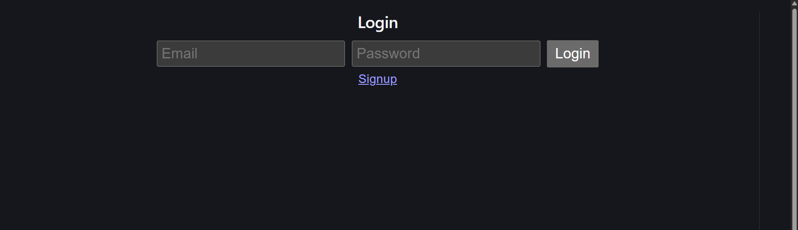
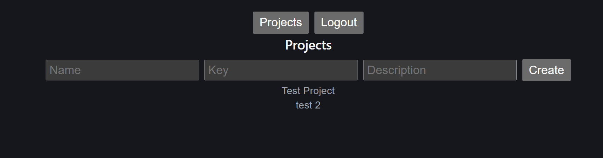
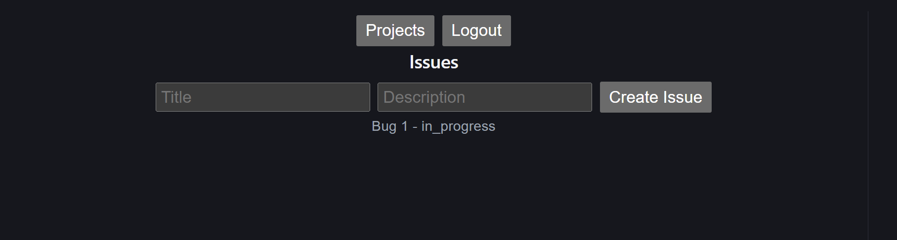
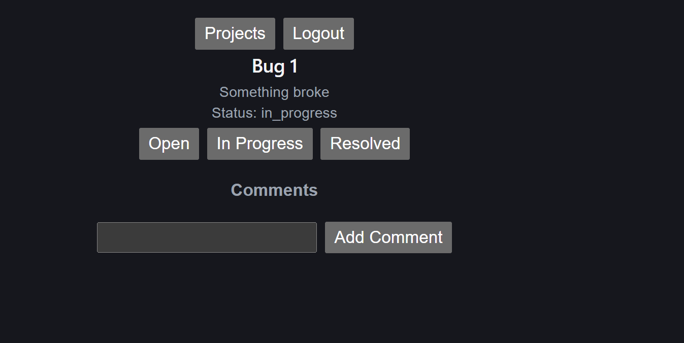
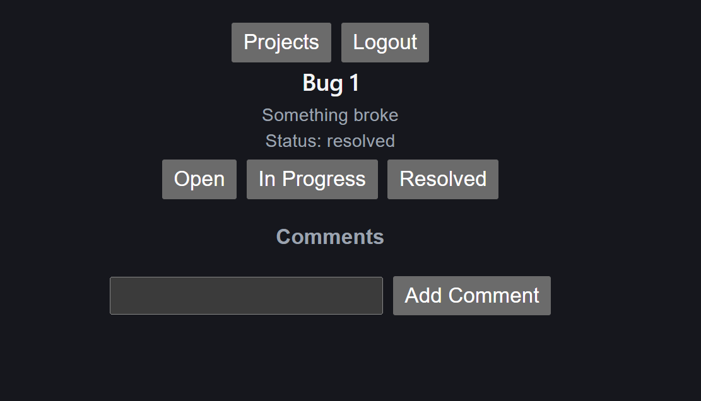
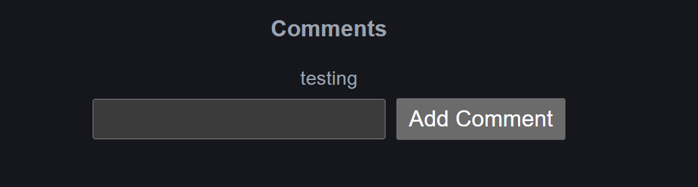

# Issue Tracker Application

## Tech Choices & Trade-offs

### Backend

* **FastAPI**

  * Pros: Fast, async support, automatic Swagger docs
  * Trade-off: Requires understanding of dependency injection

* **SQLAlchemy + SQLite**

  * Pros: Simple setup, no external DB required
  * Trade-off: Not scalable for production use

### Frontend

* **React (Vite)**

  * Pros: Fast dev server, modern tooling
  * Trade-off: Minimal structure (no Redux / advanced state mgmt)

---

## Setup Instructions

### Backend

```bash
cd backend
python -m venv venv
venv\Scripts\activate
pip install -r requirements.txt
```

### Environment Variables

Create `.env` (if applicable):

```
SECRET_KEY=your_secret
DATABASE_URL=sqlite:///./test.db
```

### Run Backend

```bash
uvicorn app.main:app --reload
```

---

### Frontend

```bash
cd frontend
npm install
npm run dev
```

---

## How to Run

* Backend → http://127.0.0.1:8000
* Swagger → http://127.0.0.1:8000/docs
* Frontend → http://localhost:5173

---

## Features

* User Authentication (Login)
* Project Management
* Issue Tracking
* Status Updates (Open, In Progress, Resolved)
* Comments on Issues
* Filtering (status, search, priority)

---

## Known Limitations

* No pagination for large datasets
* No role-based authorization (UI-level)
* Assignee selection not implemented in frontend
* Basic UI (no advanced styling)

---

## What I Would Do With More Time

* Add pagination and sorting
* Implement role-based access control
* Improve UI using a component library (e.g., Material UI)
* Add unit and integration tests
* Add real-time updates (WebSockets)
* Deploy using Docker + cloud (AWS/OCI)


## Screenshots

### Login Page



### Projects Page


### Issues List


### Issue Detail


### Status Update


### Comments
